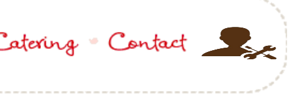

1) Install SonarQube with helm

helm repo add sonarqube https://SonarSource.github.io/helm-chart-sonarqube
helm repo update
kubectl create namespace sonarqube
helm upgrade --install -n sonarqube sonarqube sonarqube/sonarqube
 export POD_NAME=$(kubectl get pods --namespace sonarqube -l "app=sonarqube,release=sonarqube" -o jsonpath="{.items[0].metadata.name}")
  echo "Visit http://127.0.0.1:8081 to use your application"
  kubectl port-forward $POD_NAME 8081:9000 -n sonarqube


# Bake House Website

Bake House is a website for Keith Bakery home. It is a specialized pastry shop. It has a wide range from celebration cakes, children cakes, cupcakes, health cakes, .... and more.

### How To Run Website Locally:

In your browser type the website url, or open the terminal and type: 
``` sh
$ google-chrome https://mahaamin.github.io/BakeHouse/index.html
```
To view items in **Our Range** tab you will first need to create some cake-objects to be stored in the local storage:

* Use the admin panel tab:



***
* Sign-In using: 
```
Username: admin@iti.com
Password: 123456
```
***
* Add some items to be viewed in **Our Range**.
 
***

### Used Technologies:
* HTML5
* CSS
* JavaScript

***

### Contributors:
||||
|:-----------------:|:-----------:|:-----------------:|
|[Kareem El-Kasaby](https://github.com/kareemelkasaby1)|[Mina Maher](https://github.com/MinaMaher0)|[Maha Amin](https://github.com/MahaAmin)|
